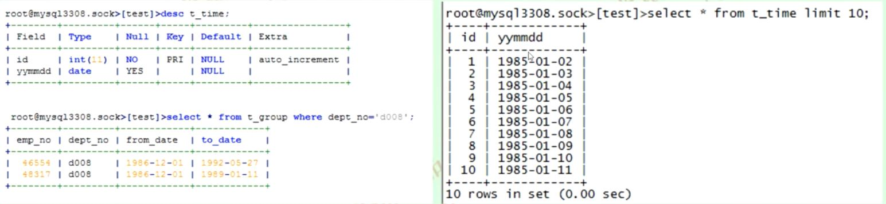

# SQL基础语法

- 单表查询
	- 单列,多列,*
	- 别名
	- 有条件的查询
	- where 1=1的作用
	- and和or
	- group by,order by,limit,having
两个表查询
	- 笛卡尔积
	- 等价join
	- between and
	- in
	- exists
	- not exists


## 查询表结构
```
1. show create table table_name;
2. desc table_name;
3. show table status  like 'table_name'\G

```
## 别名
```
1. 别名使用字符或者字符串开头,不能包含特殊字符;如果一定包含特殊字符可以使用""
```
## 有条件的查询
```
1. or两把使用括号
```

## MySQL表特性

```
1.Myisam有点类似oracle但是没有buffpool的概念只能存索引,且索引中不包含主键
2. InnoDB最大的特点是二级索引包含主键,主键当回表的key point用类似oracle的rowid所以这些特点导致InnoDB pk不能太长
```

## where 1=1的作用

```
在看别人写SQL中，可能看到where 1=1这样的代码，这样的代码是为了达到前后一致性
如where 1=1 and 条件='' and  条件=''等类似这样情况,在写代码中拼接and 条件=''
```

## between join
  
```
between join 一般情况下不会使用,但是特殊情况下会使用,主要运用如下情况,求出dept_no为d008组的人员上班的天数

select a.emp_no,conut(1) from t_group a , t_time b
where a.emp_no='d008'
and b.yymmdd >=a.from_date
and b.yymmdd <=a.to_date
group by a.emp_no
order by a.emp_no
```


## 添加主外键时检查
```
主键检查:select count(1) from table_name group by id having count(1)>1;
外键检查:select count(1) from t_group a where not exists (select 1 from employees b where a.id=b.id)

```

## 提问艺术
 