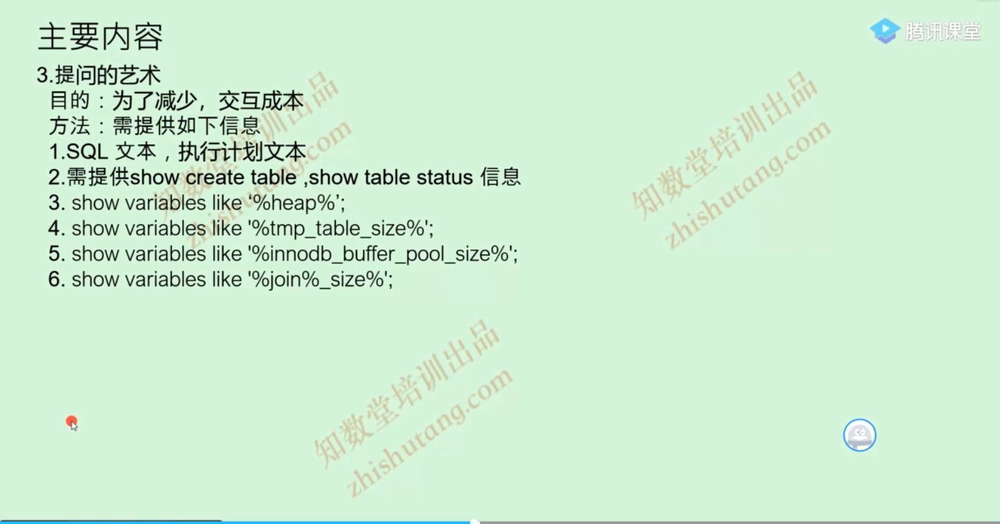

# 执行计划


## id
```
从上到下按照顺序,id从1开始自增

```
## select_type
```
1. simple
2. primary
3. union
4. subquery
5. dependent subquery
6. derived
7. materialized
```
## 视图合并的相关设置
```
show global variables like '%opt%' \G 
set session optimizer_switch='derived_merge=off'
Variable_name: optimizer_switch
Value: index_merge=on,index_merge_union=on,index_merge_sort_union=on,index_merge_intersection=on,engine_condition_pushdown=on,index_condition_pushdown=on,mrr=on,mrr_cost_based=on,block_nested_loop=on,batched_key_access=off,materialization=on,semijoin=on,loosescan=on,firstmatch=on,duplicateweedout=on,subquery_materialization_cost_based=on,use_index_extensions=on,condition_fanout_filter=on,derived_merge=on,use_invisible_indexes=off,skip_scan=on,hash_join=on,subquery_to_derived=off,prefer_ordering_index=on
子查询被合并掉
讨论:dervied_merge on/off对sql优化有什么影响
1. 为no的时候被驱动表的连接条件需要有索引
2. 为off的时候被驱动表结果集要小
视图合并是5.7的新特性,建议使用,使用的前提是被驱动表的关联字段需要有索引(视图合并慢是因为被驱动表中没有索引),5.6是没有视图合并的
会先生成一个derived表,并关键derived表的auto_key,其实视图合并的优势不在于生成一个derived表的过程,被驱动表关联上加上索引就相当于5.6中的auto_key效果


```

## simple

```
不使用union或者subquery的简单query
```

## primary

```
使用union或者subquery的简单query,或者不能进行试图合并
不能进行试图合并的关键字有:limit
视图合并是优化sql
```

## UNION

```
union 出现 UNION RESULT 产生临时表
union all 不会产生UNION RESULT 因为不去重
```

## subquery
```
这里subquery是不使用在from后面的subquery
这样是跟外部表没有啥关联
```

## dependent subquery
```
必须依附于外面的值如scala subquery或exists
8.0.16以后可以使用straight_join来重现
```


## Derived
```
1. Feom后面表的位置上的subquery
2. Dervied是生成在内存或者临时表空间中的
3. 如果derived当作驱动表的时候要点是减少数据量为目的
4. 当作被驱动表的时候产生auto_key索引页是要以数据量为目的
派生表优化的结果集
```
## materialized
```
使用in的时候产生,8.0使用exist是也产生,都生成auto_key索引
```


## 提问艺术
 